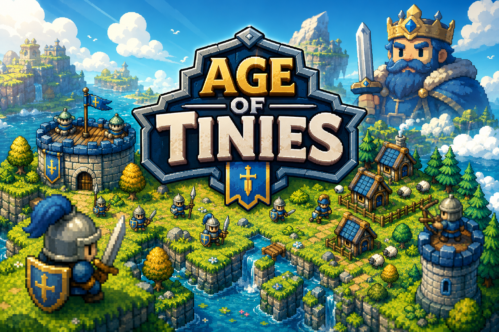

# Age of Tinies

A tiny-armies real-time strategy game where you gather resources, build a base, train troops, and crush the enemy castle. Two sides share one handcrafted island — **you (Blue)** against an **AI opponent (Red)** that gathers, builds, trains, and attacks on its own.

🎮 **Play it now in your browser:** https://hphremote.itch.io/age-of-tinies



---

## ⚔️ Features

- **Full RTS match** on a procedurally decorated island — plains, plateaus (high ground), coastlines, forests, gold mines, and roaming sheep.
- **Economy:** gather **Wood**, **Gold**, and **Meat**; villagers (Pawns) carry resources back to depots.
- **Build & train:** Houses, Barracks (Warrior / Lancer), Archery (Archer), Monk hut, and Watchtowers. Castles and towers shoot arrows; archers can garrison towers for high-ground bonuses.
- **Combat:** melee and ranged units, Monk healing, siege of buildings, and a castle-destruction win/lose condition.
- **Fog of war** with day/night darkness that lifts when the match ends.
- **A real AI opponent** that diversifies its workforce, builds production buildings, trains an army, and pushes when it outnumbers you.
- **Audio:** 27 sound effects (multiple random variants per action) plus background music.
- Runs on **Web** and **Android** (iOS planned — see below).

---

## 🛠️ How it was made

Age of Tinies is built with the **[Godot Engine](https://godotengine.org/) 4.7** (GL Compatibility renderer) and is, unusually, **constructed entirely in code** — there is no hand-edited scene tree. The whole world (terrain autotiling, slopes, coastlines, units, UI, and economy) is generated at runtime from `Builder.gd` and a handful of supporting scripts (`Fighter.gd`, `Building.gd`, `HeightMap.gd`, `Sheep.gd`, `ResNode.gd`).

The project started as a 2D top-down experiment in Unity, but manual Y-sorting and foot-anchoring kept fighting us, so it was rewritten in Godot to take advantage of its built-in Y-sort and node-at-feet positioning. From there it grew into a full match: terrain generation, pathfinding with obstacle avoidance, a resource/economy loop, building construction, a snowballing AI, fog of war, garrisonable towers, and a polished mobile-friendly UI.

It is developed iteratively, play-test by play-test, with a focus on getting the *feel* right on both desktop and touch screens.

---

## 🎨 Credits

| Asset | Author | License |
|-------|--------|---------|
| **Tiny Swords** art pack (sprites, tiles, UI) | [Pixel Frog](https://pixelfrog-assets.itch.io/tiny-swords) | Free to use (see pack page) |
| **MedievalSharp** font | [Google Fonts](https://fonts.google.com/specimen/MedievalSharp) | SIL Open Font License (OFL) |
| Background music | [Epidemic Sound](https://www.epidemicsound.com) | Subscription license — *not redistributed in this repo* |
| Sound effects | [ElevenLabs](https://elevenlabs.io) | AI-generated |
| Game engine | [Godot Engine](https://godotengine.org/) | MIT |

> "Tiny Swords" is the name of the **art pack** by Pixel Frog, not the name of this game. Please support the original artist.

### Contributors

- **hphremote** — creator & maintainer

*Contributors are added here automatically when their pull request is merged.* 🎉

---

## 🤝 Contributing — everyone is welcome!

This is an open, community-friendly project and **we'd love your help** — whether it's gameplay features, balance tweaks, bug fixes, new units, art integration, performance, or documentation.

**How to contribute:**

1. Fork the repo and create a branch.
2. The game is code-built — most logic lives in `Builder.gd` and the `*.gd` scripts. Run it with Godot 4.7+.
3. Open a Pull Request describing your change.
4. Once merged, **your name is automatically added to the Credits section above.**

No contribution is too small. New here? Look for issues labeled `good first issue`.

---

## 🚀 Roadmap & the deal for contributors

If the project gains enough community support, the plan is to:

- 📱 **Ship to the Google Play Store and the Apple App Store** (the Android build already targets `com.ageoftinies.app`; iOS is planned).
- 💰 **Monetize with in-app ads.**

**Revenue sharing:** net advertising revenue from the published mobile game is intended to be **shared among contributors in proportion to how much code each person contributed** (measured by share of merged lines of code). The more you build, the bigger your slice.

> ℹ️ *This is a good-faith statement of intent by the maintainer, not a binding financial contract. Exact terms (e.g. how lines are counted, payout thresholds, and any contributor agreement) will be finalized and published before the game goes live on the stores. By contributing you agree your work is merged under this project's license.*

---

## 📦 Building from source

- Install **Godot 4.7** (Standard / GL Compatibility).
- Open the project folder in Godot and press **Play**, or run headless:
  ```
  godot --path . 
  ```
- **Web export:** uses the `Web` preset (threads enabled). Host with cross-origin isolation (COOP/COEP) headers for SharedArrayBuffer.
- **Android export:** non-gradle build, package `com.ageoftinies.app`.

---

## 📜 License

The **game code** in this repository is open for contribution under the repository's license. **Third-party assets** (Tiny Swords art, MedievalSharp font) remain under their respective licenses listed in Credits — please review those before redistributing.

> ⚠️ **Audio is not bundled in this repository.** The background music is licensed from **Epidemic Sound** and may not be redistributed, so it is kept out of the repo; the sound effects were generated with **ElevenLabs**. To run the game with sound, supply your own audio files in `audio/` (`bg.wav` and the SFX under `audio/sfx/`).

---

*Made with ❤️ and a lot of tiny soldiers.*
